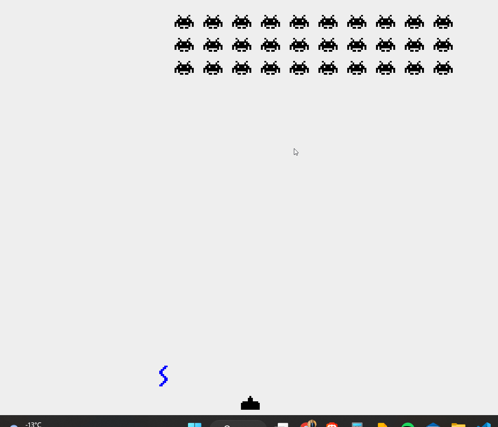

# Alien Shipnator Game

A Java game, where you shoot aliens and avoid being hit by their shots.

## How to Play

Use the left and right arrow keys to move the gunning ship and aim at the aliens. Press the space bar to shoot at the aliens. The aliens will come down from the top of the screen and try to touch the gunning ship. If an alien touches the ship or the ship is hit by an alien's shot, the game will be over.

## Features

- Multiple rows of aliens that move down the screen as time passes
- Gunning ship that can be moved and fired using keyboard controls
- Graphical output using the Java Swing library

## What I Learned

In this project, I learned:

- Working with Java and creating multiple classes that work together
- Using 2D arrays and the Java Swing library for graphical output
- Working with the ArrayList class in Java

## Compiling and Running

Ensure that you have the latest version of Java installed on your computer.

### To Compile

      javac -d bin src\*.java
   
### Run
   
      java -cp bin\ Display

The game should now start and you can play using the keyboard controls.

## Visual Demonstration

